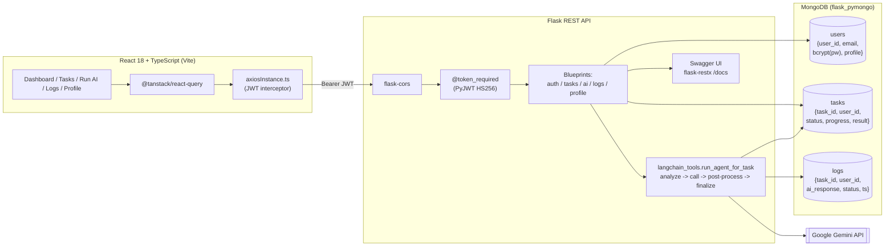

# Agent Task Tracker

> **KPI Agent** - an AI-powered task-automation platform that turns plain-English task descriptions into Gemini-driven, fully logged, auditable AI executions.


---

## What it does

Most teams want to "plug an LLM into their workflow" but end up with throwaway scripts, no audit trail, and no UI to hand to non-engineers.

**Agent Task Tracker** is the missing control plane. Users sign up, define a task once (title + description + type + schedule + priority), and then trigger a **multi-step agentic loop** that:

1. Loads the task from MongoDB.
2. Builds a structured prompt for the Gemini API.
3. Post-processes the response.
4. Writes the final answer, progress, status and full trace back to MongoDB.

Every execution is captured in an immutable activity-log collection so ops, support and product teams can search, filter and audit what the AI did, when, and for whom.

**Concrete use-cases shipped today:**

- Auto-drafted replies to support tickets (Classification + Summarization).
- Translation pipelines for multi-language inbound mail.
- Custom-prompt automations (any free-form task description becomes a runnable AI job).
- Daily / weekly scheduled runs with completion notifications and auto-retry.

---

## System architecture



**Request lifecycle (Run-AI path):**

```
React page  ->  axios + Bearer JWT
            ->  Flask CORS
            ->  @token_required (decodes JWT, sets g.user_id)
            ->  /tasks/<task_id>/run-ai
            ->  run_agent_for_task(task_id, user_id)
                 1. analyze_task        (load task from MongoDB)
                 2. call_gemini_api     (PromptTemplate -> HTTPS POST)
                 3. postprocess_response
                 4. finalize_task       (update tasks, insert logs)
            ->  JSON { ai_response, steps_completed }
```

---

## Key engineering highlights

- **Stateless JWT middleware** - a single `@token_required` decorator wraps every protected endpoint, decodes the HS256 token, and binds `g.user_id` for the request. No per-request session DB lookups.
- **Multi-step agentic pipeline** - `run_agent_for_task` runs a deterministic 4-step loop (`analyze_task -> call_gemini_api -> postprocess_response -> finalize_task`) with explicit per-step status writes, so a failure halfway through still flips the task to `error` and writes a diagnostic log line.
- **Prompt templating with LangChain** - Gemini prompts are built from a `PromptTemplate` rather than f-string concatenation, so structure stays decoupled from data.
- **Audit-first data model** - every AI execution is double-written (task document + dedicated `logs` collection), giving a permanent activity timeline independent of task-document mutation.
- **Hardened API surface** - bcrypt password hashing, scoped CORS origins, JSON-only error envelope `{ error, details }`, 20 s Gemini timeout, and explicit `error` status on any unhandled exception in the agent loop.
- **Swagger out-of-the-box** - `flask-restx` mounts a live, browsable API explorer at `/docs` so reviewers don't need Postman.
- **Typed React + server-state caching** - TypeScript everywhere, `@tanstack/react-query` for cache + invalidation, Axios interceptor pattern that DRYs auth + 401 handling out of every page.
- **Component-driven UI** - 40+ Radix UI / shadcn primitives, Tailwind utility theming, HashRouter + `PrivateRoute` HOC for client-side route guarding.

---

## Database schema

```jsonc
// users
{
  "user_id":   "uuid-v4 string",   // canonical user identity (used everywhere)
  "email":     "user@example.com", // unique
  "password":  "<bcrypt hash>",
  "name":      "Jane Doe",
  "role":      "user",
  "firstName": "Jane", "lastName": "Doe",
  "phone": "...", "location": "...", "timezone": "...",
  "created_at": "<UTC datetime>"
}

// tasks
{
  "task_id":     "uuid-v4",
  "user_id":     "uuid-v4",          // FK -> users.user_id
  "title":       "Summarize churned-user emails",
  "description": "...",
  "status":      "pending|running|completed|error",
  "progress":    0..100,
  "type":        "Classification|Summarization|Translation|Custom",
  "priority":    "low|medium|high",
  "schedule":    "manual|daily|weekly",
  "notify":      true,
  "auto_retry":  false,
  "result":      "<gemini output>",
  "created_at":  "<UTC>",
  "last_run":    "<UTC | null>"
}

// logs  (append-only activity log)
{
  "task_id":     "uuid-v4",
  "user_id":     "uuid-v4",
  "ai_response": "<gemini output or 'Error: ...'>",
  "status":      "success|error",
  "timestamp":   "<UTC>"
}
```

---

## API endpoints

> Base URL: `http://localhost:5000`  -  Browse interactively at `/docs` (Swagger UI).

| Domain  | Method | Path                          | Auth | Body / Params                                                                       | Returns                                              |
| ------- | ------ | ----------------------------- | :--: | ----------------------------------------------------------------------------------- | ---------------------------------------------------- |
| Auth    | POST   | `/signup`                     |  No  | `{ name, email, password }`                                                         | `{ token, user_id, name }`                           |
| Auth    | POST   | `/login`                      |  No  | `{ email, password }`                                                               | `{ token, user_id, name }`                           |
| Profile | GET    | `/profile/`                   | JWT  | -                                                                                   | full profile (minus password)                        |
| Profile | PUT    | `/profile/`                   | JWT  | any of `firstName, lastName, email, phone, location, role, department, timezone`    | `{ message }`                                        |
| Tasks   | POST   | `/tasks`                      | JWT  | `{ title, description?, status?, type?, priority?, schedule?, notify?, auto_retry? }` | `{ task_id }`                                      |
| Tasks   | GET    | `/tasks?status=<filter>`      | JWT  | optional `status` query (`pending|running|completed|error|all`)                     | `{ tasks: [...] }`                                   |
| Tasks   | PUT    | `/tasks/<task_id>`            | JWT  | partial `{ title, description, status }`                                            | `{ message }`                                        |
| Tasks   | DELETE | `/tasks/<task_id>`            | JWT  | -                                                                                   | `{ message }`                                        |
| Run-AI  | POST   | `/tasks/<task_id>/run-ai`     | JWT  | -                                                                                   | `{ ai_response, steps_completed }`                   |
| Logs    | GET    | `/logs`                       | JWT  | -                                                                                   | `[ { task_id, ai_response, status, timestamp } ]`    |
| Docs    | GET    | `/docs`                       |  No  | -                                                                                   | Swagger UI                                           |

All protected endpoints require `Authorization: Bearer <jwt>`. Error envelope: `{ "error": "...", "details": "..." }`.

---

## Quick start

### 0. Prerequisites

- **Python** 3.10+
- **Node.js** 18+ and **npm** 9+
- **MongoDB** running locally (`mongodb://localhost:27017`) or a connection string for Atlas
- A **Google Gemini API key** (https://aistudio.google.com/)

### 1. Clone

```bash
git clone git@github.com:trishnadas7897/Agent-Task-Tracker.git
cd Agent-Task-Tracker
```

### 2. Backend - environment

Create `backend/.env` (do NOT commit it):

```env
MONGO_URI=mongodb://localhost:27017/kpi_agent
JWT_SECRET=replace-me-with-a-long-random-string
JWT_EXP_DAYS=1

GEMINI_API_KEY=your-gemini-key
GEMINI_API_ENDPOINT=https://generativelanguage.googleapis.com/v1beta/models/gemini-1.5-flash-latest:generateContent
GEMINI_MODEL_NAME=gemini-1.5-flash-latest
```

### 3. Backend - install & run

```bash
cd backend
python -m venv .venv
source .venv/bin/activate          # Windows: .venv\Scripts\activate
pip install -r requirements.txt
python run.py                      # serves http://localhost:5000  (Swagger at /docs)
```

### 4. Frontend - environment

Create `frontend/.env`:

```env
VITE_API_BASE_URL=http://localhost:5000
```

### 5. Frontend - install & run

```bash
cd ../frontend
npm install
npm run dev                        # serves http://localhost:5173 (or 8081)
```

Open the dev URL, sign up, create a task, head to **Run AI**, and trigger your first agentic run. Watch it land in **Activity Logs** in real time.

---

## Repository layout

```
Agent-Task-Tracker/
|-- backend/
|   |-- app/
|   |   |-- __init__.py            # Flask app factory, CORS, Swagger, blueprint registration
|   |   |-- routes/
|   |   |   |-- auth_routes.py     # /signup, /login
|   |   |   |-- profile_routes.py  # /profile (GET, PUT)
|   |   |   |-- task_routes.py     # /tasks CRUD
|   |   |   |-- ai_routes.py       # /tasks/<id>/run-ai
|   |   |   `-- logs_routes.py     # /logs
|   |   |-- models/                # users, tasks, logs mongo helpers
|   |   `-- utils/
|   |       |-- jwt_helper.py      # generate_jwt_token + @token_required
|   |       `-- langchain_tools.py # multi-step agentic Gemini loop
|   |-- config.py
|   |-- requirements.txt
|   `-- run.py
`-- frontend/
    |-- src/
    |   |-- pages/                 # Dashboard, Tasks, RunAI, Logs, Profile, Login, Signup
    |   |-- components/ui/         # 40+ shadcn/Radix primitives
    |   |-- context/AuthContext.tsx
    |   |-- services/axiosInstance.ts
    |   `-- lib/api.ts
    |-- tailwind.config.ts
    `-- vite.config.ts
```

---

## Roadmap

- [ ] Move Gemini calls onto Celery + Redis so `/run-ai` returns 202 immediately and the frontend polls / streams status.
- [ ] Compound MongoDB indexes on `tasks(user_id, status)` and `logs(user_id, timestamp DESC)`.
- [ ] Pytest integration tests + Vitest + React Testing Library coverage gates.
- [ ] Refresh-token rotation + short-lived access tokens.
- [ ] Per-user Gemini-token usage metering and quotas.
- [ ] Dockerfile + `docker-compose.yml` for one-command local stack.

---

## License

MIT - see `LICENSE`.
